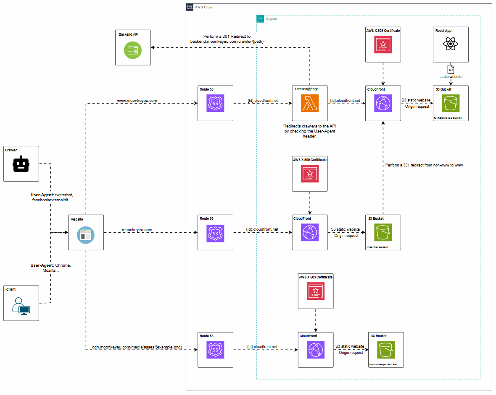
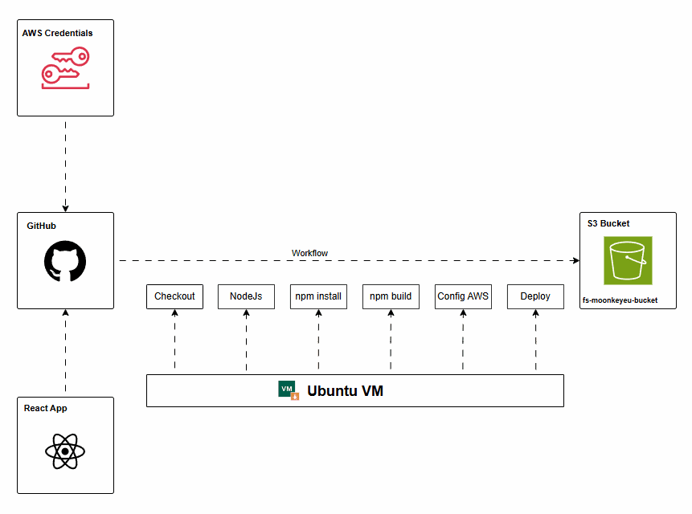
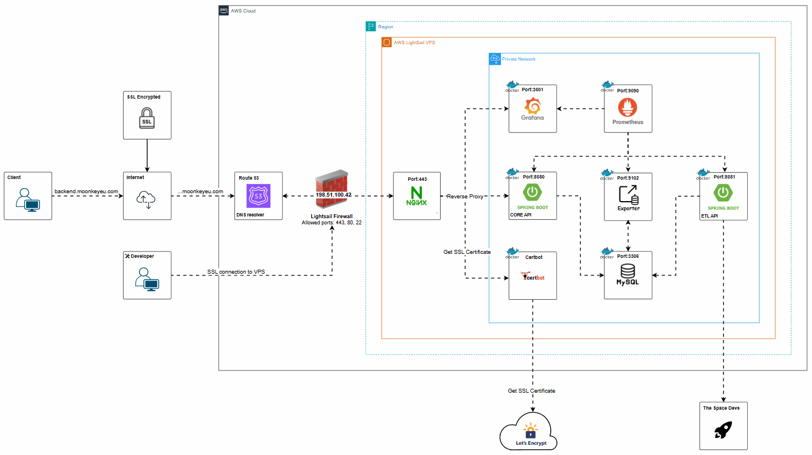
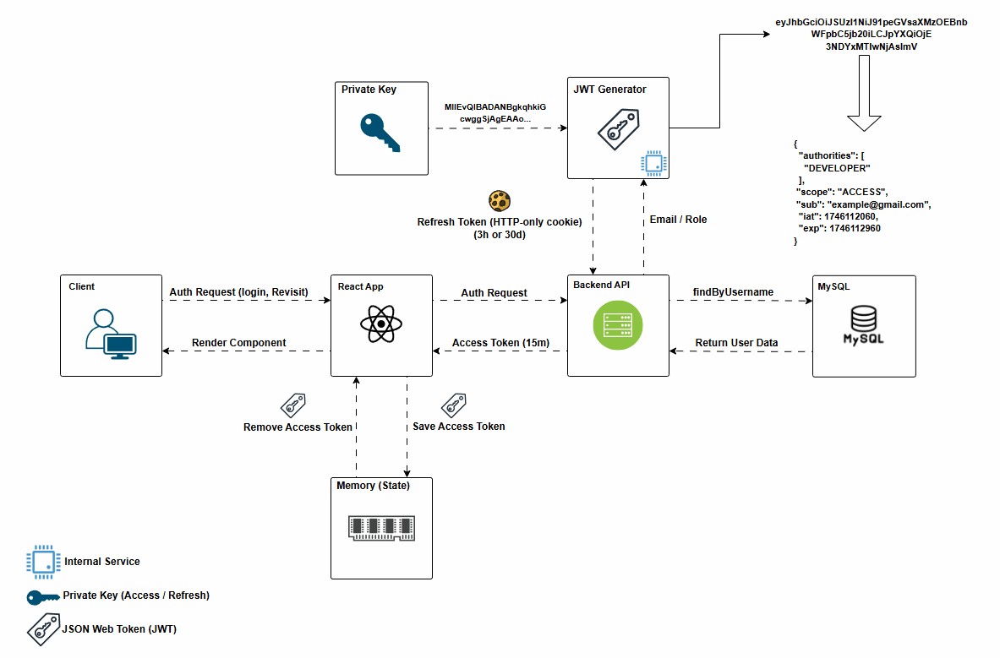

# 🚀 MoonkeyEU Space Launch Tracker

  

Welcome to **MoonkeyEU**! This is a space launch tracker application that keeps you informed about past and upcoming space launches. 
Discover details about astronauts, programs, boosters and more. Built with **React**, **Spring Boot**, **MySQL** and **deployed on AWS**, 
MoonkeyEU offers a clean and interactive experience for space enthusiasts.

---

# 🌟 Features

- **User Authentication:** Sign up, log in, and securely manage your account.
- **Explore Sections:** Discover launches, astronauts, programs, spacecraft, and more!
- **Detailed Information:** Get comprehensive details about launches, astronaut biographies, and space program contributors.
- **NASA Astronomy Picture of the Day:** Discover a new astronomy image each day, along with insightful explanations from NASA.
- **Stay Up to Date:** Stay informed with the latest news!
- **Bookmarking:** Save your favorite launches to read about them later.
- **Profile Management:** Manage your username, email, and password with ease.
- **Admin Dashboard:** Monitor registered members, view Grafana graphs, and manage contact messages.

>- ⚙️ **Coming Soon:** Details about space stations!
>- ⚙️ **Coming Soon:** Notifications for upcoming launches!

---

# 🛠️ Installation

**Backend and Frontend Installation:** Setup instructions for the backend can be found in the [`backend/README.md`](./backend/README.md) file, and for the frontend in the [`frontend/README.md`](./frontend/README.md) file.

---

# ☁️ Cloud Architecture

## ⚙️ Frontend Infrastructure

  

This architecture delivers a scalable, secure, and fast frontend experience using several AWS services. It supports dynamic content for social sharing, secure communication and global content delivery.

### Route 53 (DNS)
- Resolves human-readable domain names (e.g., `www.moonkeyeu.com`) to machine-readable IP address used by AWS services.

### Lambda@Edge
- Redirects requests from social media crawlers (e.g., Facebook, Twitter) to the backend.
- Allows dynamic generation of the `<head>` tag in HTML pages for better SEO and rich link previews.

### Amazon S3 (Static Hosting)
- Stores and serves static frontend assets such as:
    - React build files (HTML, JavaScript, CSS)
    - Images and icons
    - Public JSON or config files
- A **separate S3 bucket and CloudFront distribution** are also used to redirect `non-www` traffic (e.g., `moonkeyeu.com`) to the preferred `www.moonkeyeu.com` version of the domain.

### AWS Certificate Manager (ACM)
- Issues and manages SSL/TLS certificates.
- Enables secure HTTPS communication between the client and AWS services.

## 📈 How It Works

1. A user enters the domain www.moonkeyeu.com in a browser.
2. **Route 53** resolves the domain to the CloudFront distribution.
3. If the request is for `moonkeyeu.com` (non-www), it is routed through a **dedicated CloudFront + S3 setup** that issues a 301 redirect to `www.moonkeyeu.com`.
4. CloudFront fetches static files from **S3**.
5. If a request comes from a social media bot, **Lambda@Edge** redirects it to the backend to fetch dynamic metadata.
6. All traffic is secured using SSL certificates managed by **ACM**.

---

## Automated Frontend Deployment

  

To streamline the deployment of the frontend which changes more frequently than the backend I use GitHub Actions to fully automate the CI/CD pipeline.

## ⚙️ Backend Infrastructure

  

The backend is hosted on an **Amazon Lightsail VPS** using **Docker Compose**, running all services in a private Docker network for security and performance.

### Nginx Proxy
- Acts as a reverse proxy that routes external traffic to the correct internal service.

### Spring Boot Core API
- Manages user authentication and authorization.
- Provide launches data to the frontend.

### Spring Boot ETL API
- Updates and synchronizes launches data:
  - Partial updates every **2 hours**
  - Full synchronization of upcoming launch data every **midnight**

### MySQL
- Stores all application data (users, launches, etc).

### Certbot
- Issues and renews SSL certificate to enable secure communication between the frontend and backend.

### MySQL Exporter
- Extracts internal MySQL metrics to be monitored via Prometheus.

### Prometheus
- Collects metrics from all backend services (MySQL and Spring Boot APIs).

### Grafana
- Displays metrics in a user-friendly dashboard.
- Provides visibility into system health and performance.

---

# 🔒 Security Implementation

  

To ensure the security of user accounts, this application employs **JSON Web Tokens (JWT)** for authentication and **OAuth2** for Google login integration.

### Authentication Flow

1. Users initiate an authentication request by submitting their credentials.
2. The backend validates the credentials and generates two JWTs upon success: an **Access Token** and a **Refresh Token**.
3. The Refresh Token is securely stored as an **Http-only cookie** by the backend, while the Access Token is sent back in the response.
4. The React frontend holds the Access Token in memory (React state) to reduce the risk of Cross-Site Scripting (XSS) attacks.

### Additional Security Mechanisms

- **Cross-Site Request Forgery (CSRF) Protection**: Safeguards against unauthorized commands sent from a user that the web application trusts.
- **Cross-Origin Resource Sharing (CORS) Configuration**: Controls and restricts resource access from different origins to enhance security.

---

# 💪 Credits

A huge thanks to <a href="https://www.linkedin.com/company/the-space-devs/posts/?feedView=all">The Space Devs</a> for the data feed that powers this project. 
Their dedication to open data made it all possible! 

---

# ❤️ Show Your Support
If you find this project helpful, please give it a ⭐ and share it with others!

Happy Coding! 🚀
